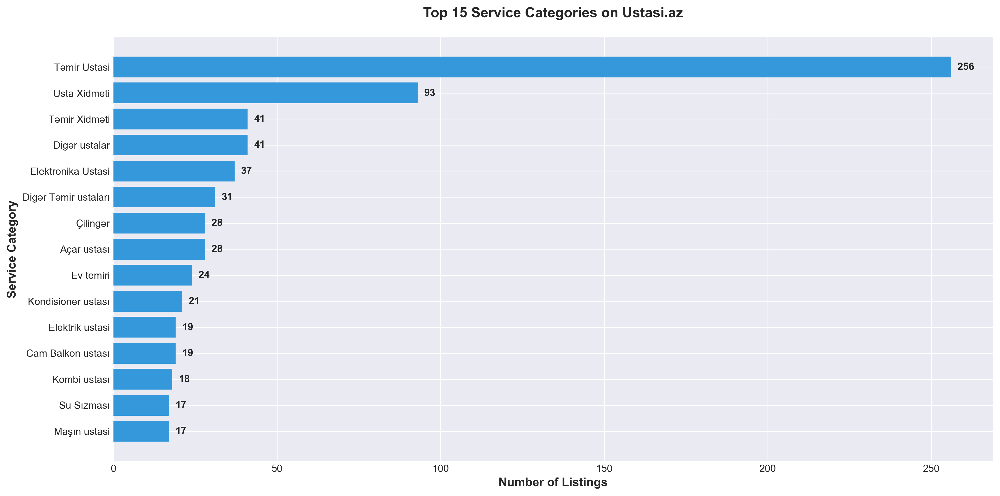
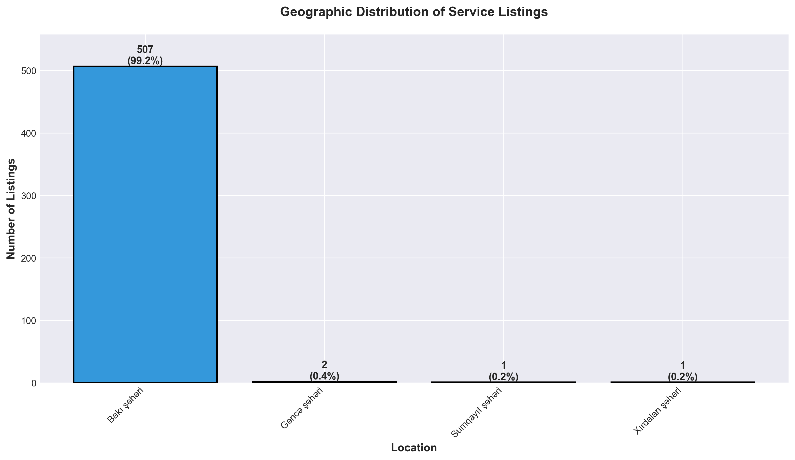
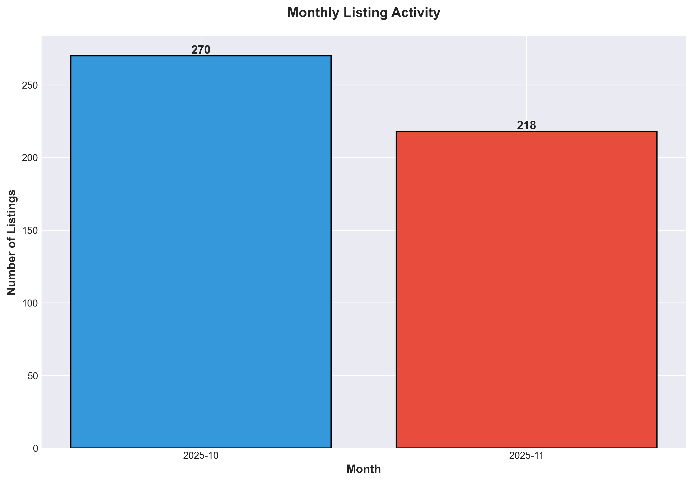
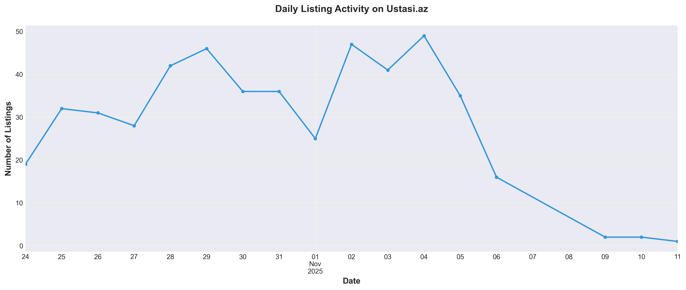
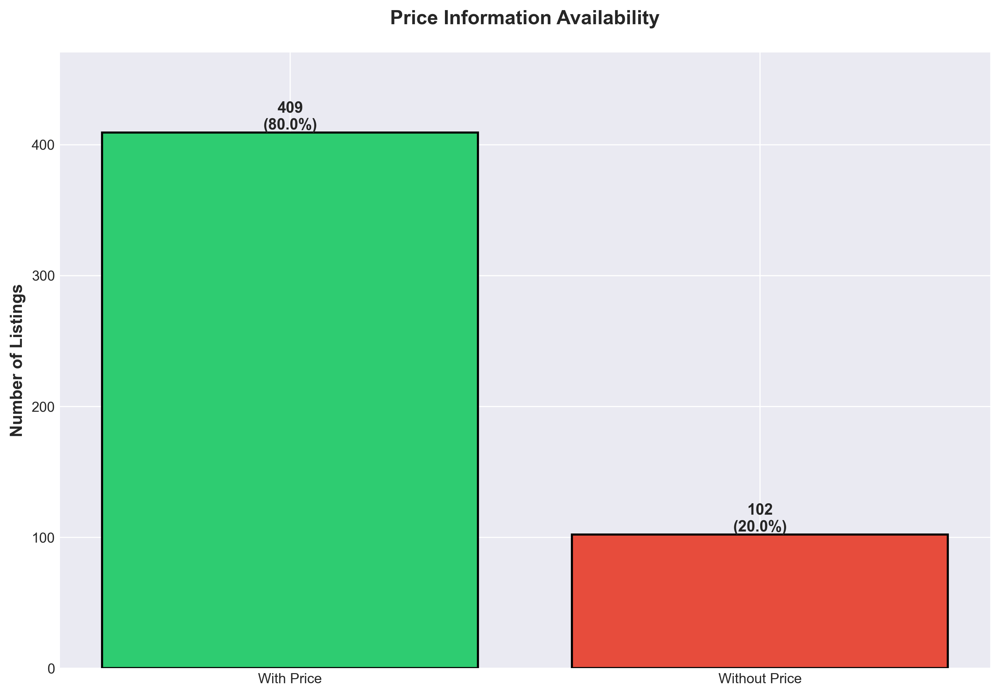
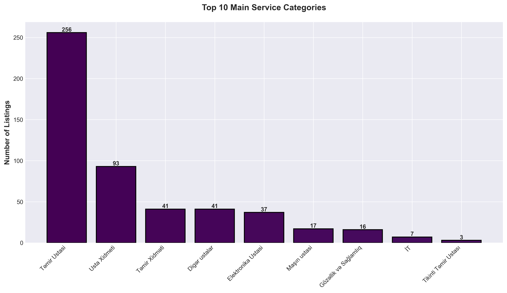
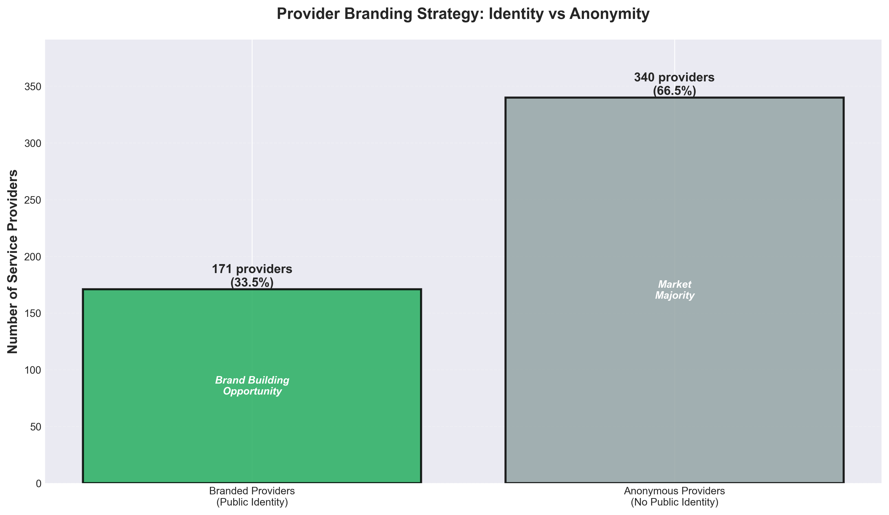

# Ustasi.az Market Analysis

## Overview

This project presents a comprehensive analysis of the service provider marketplace on **Ustasi.az**, Azerbaijan's leading platform connecting customers with skilled professionals. The analysis is based on **511 service listings** collected from the platform, providing valuable insights into Azerbaijan's local service economy and digital marketplace trends.

---

## Key Market Findings

### 1. Service Category Distribution



The marketplace is dominated by repair and maintenance services:
- **Təmir Ustasi (Repair Masters)**: 256 listings (50% of all services)
- **Usta Xidməti (Master Services)**: 93 listings (18%)
- **Electronic Services**: 37 listings (7%)

**Business Insight**: The concentration of repair-related services indicates strong demand for maintenance and fix-it services in the local market. This reflects both the home improvement needs and the prevalence of skilled tradespeople in Azerbaijan's economy.

---

### 2. Geographic Market Concentration



The platform shows extremely high geographic concentration:
- **Bakı şəhəri (Baku City)**: 507 listings (99.2%)
- **Other cities**: Only 4 listings combined (0.8%)

**Business Insight**: This overwhelming concentration in Baku reflects the capital's position as Azerbaijan's economic and population center. The minimal presence in other cities represents a significant **untapped market opportunity** for geographic expansion.

---

### 3. Market Activity & Growth Trends



**Recent Activity Analysis**:
- **October 2025**: 270 listings (52.8%)
- **November 2025**: 218 listings (42.7%)



**Business Insight**: The daily activity chart reveals fluctuating patterns of service provider engagement, with certain days showing peaks in new listings. This suggests strategic posting behavior by service providers who may be timing their listings for maximum visibility.

---

### 4. Pricing Strategy & Transparency



Pricing approach across the platform:
- **80% of listings** include upfront pricing (409 listings)
- **20% use negotiable/contact-based pricing** (102 listings)

**Business Insight**: The high level of price transparency benefits both consumers and providers:
- **For Consumers**: Enables easy comparison shopping and informed decision-making
- **For Providers**: Transparent pricing can attract price-sensitive customers and reduce time spent on inquiries
- **Market Signal**: The 20% without prices typically represent custom/complex services where pricing depends on project scope

---

### 5. Service Portfolio Diversity



The platform hosts a diverse range of professional services across multiple sectors:
- **Home Repair & Maintenance**: Market leader
- **Electronics Repair & Installation**: Second-largest category
- **Specialized Services**: Locksmiths, HVAC, plumbing, and more

**Business Insight**: This diversity indicates a mature marketplace successfully catering to various household and business needs. The breadth of categories suggests the platform has achieved critical mass across multiple service verticals.

---

### 6. Provider Identity & Trust Dynamics



Provider identification patterns:
- **66.5% operate anonymously** (340 listings)
- **33.5% publicly display their names** (171 listings)
- **100% provide contact phone numbers** (all 511 listings)

**Business Insight**:
- The preference for anonymity may reflect cultural norms or privacy concerns in the local market
- Universal phone availability ensures direct customer contact remains possible
- **Opportunity**: Implementing a reputation/review system could encourage more providers to build identifiable brands and increase customer trust

---

## Strategic Market Insights

### For Service Consumers

1. **Wide Service Access**: 500+ service providers across numerous categories provide extensive choice
2. **Price Comparison Enabled**: 80% upfront pricing allows informed purchasing decisions
3. **Immediate Contact**: Universal phone availability enables direct communication without platform intermediation
4. **Urban Focus**: Services heavily concentrated in Baku; limited options in other regions

### For Service Providers

1. **Competitive Landscape**: High concentration in repair services (50%) indicates intense competition requiring differentiation
2. **Branding Opportunity**: With 66.5% anonymity, providers who build identifiable brands could gain competitive advantage
3. **Pricing Strategy**: Choice between transparent pricing (80% do this) or negotiable pricing based on service type
4. **Market Gaps**: Significant expansion opportunity in cities outside Baku

### For Platform & Investors

1. **Market Maturity**: Active, vibrant marketplace with consistent engagement
2. **Geographic Expansion**: Minimal penetration outside Baku represents major growth opportunity
3. **Trust Infrastructure**: Low provider identification suggests value in building reputation systems, verified profiles, and review mechanisms
4. **Category Expansion**: While repair services dominate, opportunities exist in underrepresented professional services
5. **Competitive Moat**: High provider concentration and activity suggests platform has achieved network effects in Baku market

---

## Market Opportunities

### 1. Geographic Expansion
With 99.2% of listings in Baku, expansion to Ganja, Sumgait, and other major cities represents significant untapped potential.

### 2. Trust & Verification Systems
Implementing provider verification, customer reviews, and rating systems could:
- Increase platform stickiness
- Enable premium pricing for verified providers
- Improve matching quality between customers and providers

### 3. Service Category Development
While repair services dominate, professional services (consulting, design, specialized technical services) show room for growth.

### 4. Platform Monetization
The active marketplace with 500+ providers and high engagement creates opportunities for:
- Premium listings
- Lead generation fees
- Advertising placements
- Verified badge programs

---

## Data Visualization

All visualizations can be regenerated anytime by running:

```bash
python3 generate_charts.py
```

**Generated Charts**:
1. Top Service Categories Analysis
2. Geographic Market Distribution
3. Pricing Strategy Breakdown
4. Daily Market Activity Trends
5. Main Category Performance
6. Provider Identity Patterns
7. Monthly Activity Comparison

---

## Conclusion

**Ustasi.az** represents a vibrant, mature marketplace ecosystem primarily serving Baku's population with repair and maintenance services.

**Key Strengths**:
- Strong market concentration in capital city (network effects)
- High price transparency (80% of listings)
- Active provider engagement
- Diverse service category coverage

**Growth Opportunities**:
- Geographic expansion beyond Baku (99%+ concentration risk)
- Trust infrastructure development (reputation systems)
- Provider branding and differentiation tools
- Service category diversification

The platform demonstrates strong fundamentals as Azerbaijan's leading service marketplace, with clear pathways for continued growth through geographic and feature expansion.

---

**Data Source**: https://ustasi.az/
**Analysis Period**: October-November 2025
**Dataset Size**: 511 service listings
